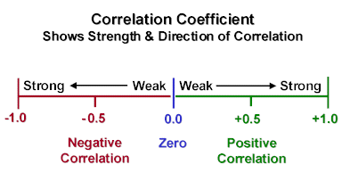
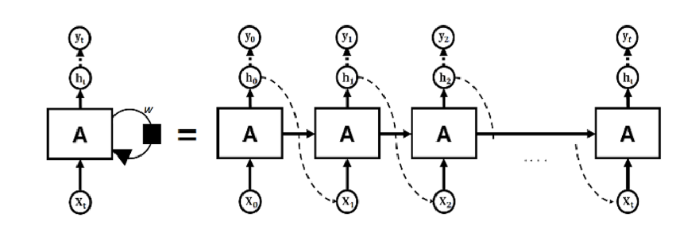
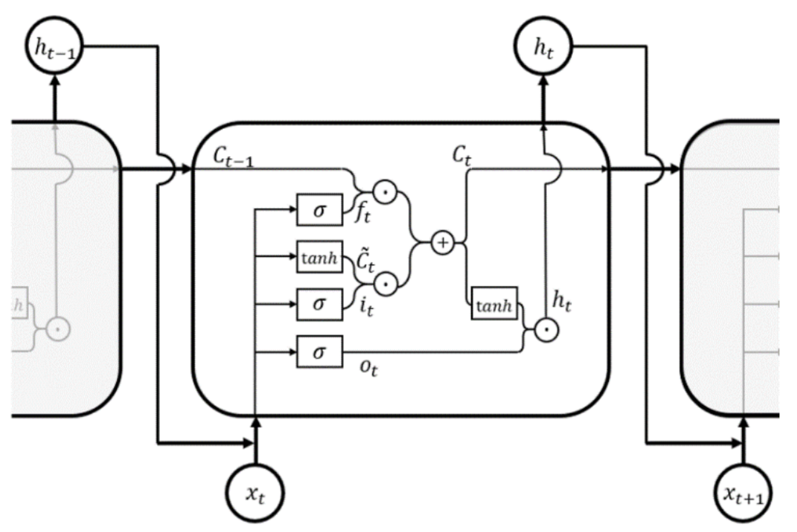
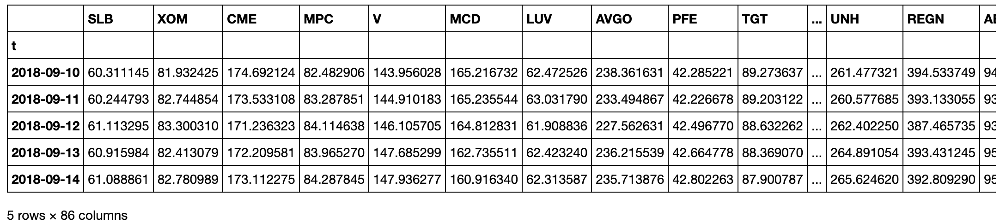
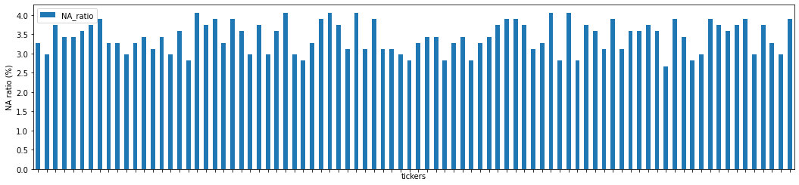
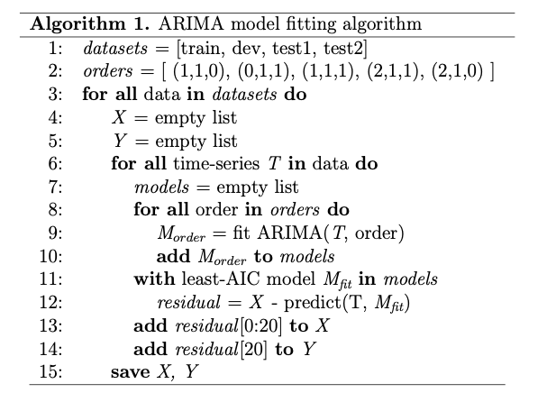
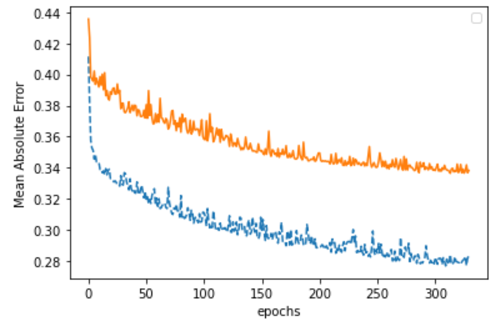
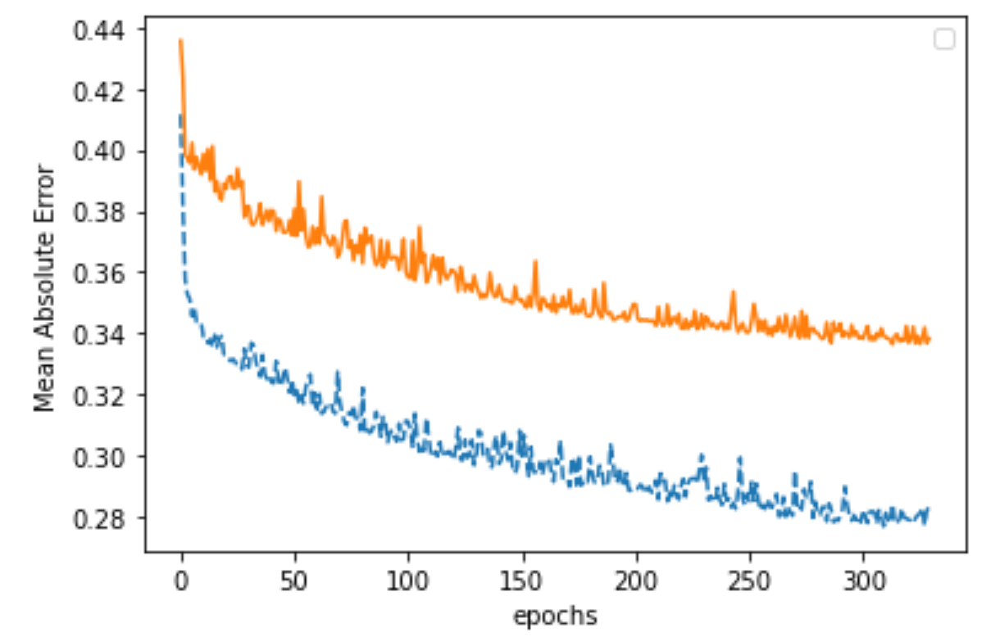
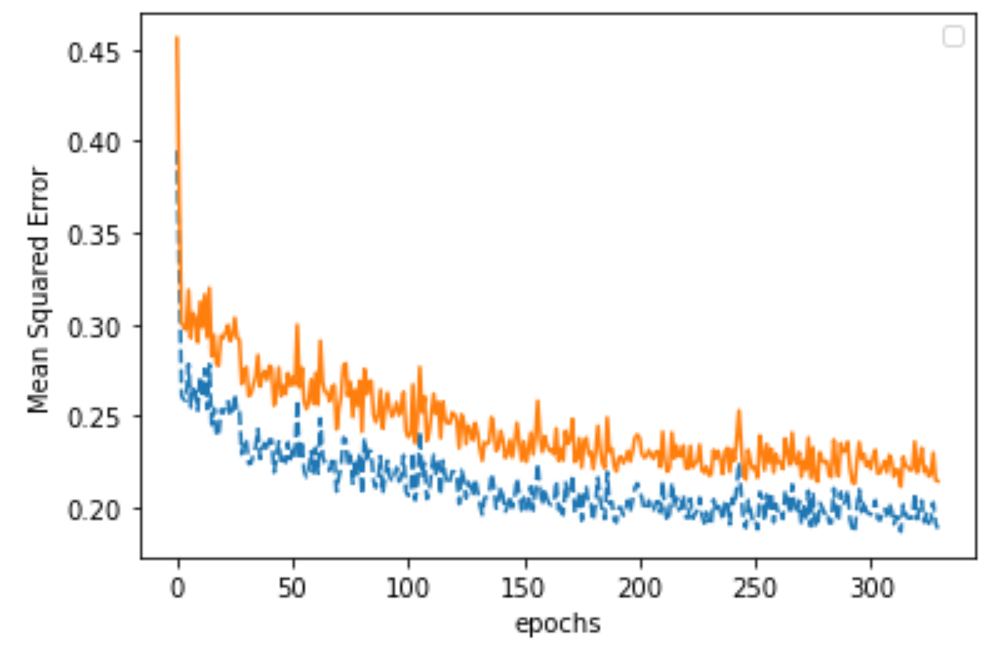

# Correlation Using ARIMA-LSTM
Mateo Osorio\
Damon D'Amico

Northwestern University\
Department of Computer Science

## Abstract

Investors have figured out a long time ago that getting computers to predict stock prices is promising and often a better way to hedge bets than getting a human to do the same. One of the important ways in which computers can do this prediction is by computing the correlation that stocks have to each other. This article is an exploration of one of the ways to find this correlation, using a combination of methods, ARIMA and LSTM. 

This work is all based on a single paper, written by Hyeong Kyu Choi from Korea University in Seoul in 2018. All of the technical work you will read here is based directly off of Choi’s work and should be credited to them as such. This article is simply an exploration into the methods Choi used, with the hope of creating a digestible source of information, and a narrated walkthrough of the usage and replication of Choi’s code and methods. 
The authors would like to thank Choi for their contributions and for their meticulously well-documented and thorough work. 

## Summary of work completed
The authors of this repository fully trained a model that predicts correlation coefficient, using data provided by our instructors. Because the data we used is not allowed to be accessed publicly, we have been asked to omit it from the repository. 

After training the model with the provided data, we used the trained model to predict the correlation of two stocks, Apple and Google. 

- [Correlation Using ARIMA-LSTM](#correlation-using-arima-lstm)
  - [Abstract](#abstract)
  - [Summary of work completed](#summary-of-work-completed)
  - [What does Correlation Mean?](#what-does-correlation-mean)
  - [What other correlation models exist?](#what-other-correlation-models-exist)
    - [Full historical model](#full-historical-model)
    - [Constant Correlation Model](#constant-correlation-model)
    - [Single-Index model](#single-index-model)
    - [Multi-group model](#multi-group-model)
  - [What is ARIMA-LSTM? Why are we using it?](#what-is-arima-lstm-why-are-we-using-it)
  - [Training the model](#training-the-model)
    - [Data preprocessing](#data-preprocessing)
    - [ARIMA](#arima)
    - [LSTM](#lstm)
  - [Evaluating our trained model](#evaluating-our-trained-model)
  - [Apples and Googles](#apples-and-googles)
  - [Implications in Quantitative Finance and Conclusions](#implications-in-quantitative-finance-and-conclusions)
  
## What does Correlation Mean?
It is often in finance that the same forces affect similar stocks. If, for example, a new oil well is discovered in Alaska, the stock price of oil companies that operate in the area might go up in anticipation of new businesses, along with an increase in stock prices for car companies, since cheap gas tends to lead to more car sales. 
Given this example, imagine a computer could figure out that gas and car companies tend to go move together, so when the system detects a change in one sector, they can employ some sort of selling or buying strategy in an effort to make some return on previous or current investments in the other sector. 

Even in this small example, it is easy to see that this problem becomes massively complex very quickly. In a web of thousands and thousands of interconnected nodes, many of which aren’t even written down, it is incredibly difficult to see which connections are relevant, which ones we can learn from, and sometimes more importantly, which ones to ignore. 

We can represent how much two stocks are correlated using a number (called the correlation coefficient), which lives somewhere between -1 and 1. The magnitude of the number tells us how strongly the two stocks are correlated, and the sign tells us in which direction they are correlated 

  
Source: BabyPips

All of the models we’ll be going through in the following sections are attempts at figuring out the $c_p$ value for all possible pairs of stocks.

## What other correlation models exist?
### Full historical model
This is the simplest model, in which the correlation coefficient for a time period between two stocks is simply equal to the coefficient at a previous time period. Very simple and naive, and not quite useful in this application, but still relevant. 

$$
\begin{aligned}
\hat\rho_{ij}^{(t)} = \hat\rho_{ij}^{(t-1)}\\
\end{aligned}\\

\begin{aligned}
\text{i,j: asset index in the correlation coefficient matrix}
\end{aligned}
$$

### Constant Correlation Model 
Another naive approach with some uses in other applications. Here we assume that all coefficients in the model must be equal, and they are all equal to the mean correlation coefficient. 

$$
\begin{aligned}
\hat\rho_{ij}^{(t)} = \frac{\sum\limits_{i>j}^{} \rho_{ij}^{(t-1)}}{n(n-1)/2}
\end{aligned}\\

\begin{aligned}
\text{i,j: asset index in the correlation coefficient matrix}
\end{aligned}\\
\begin{aligned}
\text{n: number of assets in the portfolio}
\end{aligned}
$$

### Single-Index model
This model assumes that the return of each stock is correlated to the return of the entire market. We can establish the return of an asset using some variables and the return of the whole market at a certain time period. After, we can determine the correlation coefficient between two assets based on that information. 

$$
R_{i,t} = \alpha_i + \beta_i R_{m,t} + \epsilon_{i,t}
$$

$R_{i,t}$ : return of asset $i$ at time $t$\
$R_{m,t}$ : return of the market at time $t$\
$\alpha_i$ : risk adjusted excess return of asset $i$\
$\beta_i$ : sensitivity of asset $i$ to the market\
$\epsilon_{i,t}$ : residual return, error term such that $E(\epsilon_i) = 0$ ; $Var(\epsilon_i) = \sigma^2_{\epsilon_i}$

$$
Cov(R_i, R_j) = \rho_{ij} \sigma_i \sigma_j = \beta_i \beta_j \sigma_m^2
$$
$\sigma_i / \sigma_j$ : standatd deviation of asset $i/j$'s return

$\sigma_m$ : standard deviation of market return

The estimated correlation coefficient $\hat\rho_{ij}$ would be
$$
\hat\rho_{ij}^{(t)} = \frac{\beta_i \beta_j \sigma_m^2}{\sigma_i \sigma_j}
$$

### Multi-group model
This model, as the name would suggests, groups assets into different buckets. In the case of stocks, it groups them by sector. This is under the assumption that stocks in the same sector will perform similarly. It’s the same as the single index, but with the additional grouping. 

If $\alpha=\beta$:

$$
\hat\rho_{ij}^{(t)} = \frac
{\sum\limits_{i\in\alpha}^{n_\alpha} \sum\limits_{j\in\beta,i\neq  j}^{n_\alpha} \rho_{ij}^{(t-1)}}
{n_\alpha (n_\beta-1)}
$$
else:
$$
\hat\rho_{ij}^{(t)} = \frac
{\sum\limits_{i\in\alpha}^{n_\alpha} \sum\limits_{j\in\beta,i\neq  j}^{n_\alpha} \rho_{ij}^{(t-1)}}
{n_\alpha n_\beta}
$$

$\alpha / \beta$ : industry sector notation

$n_\alpha / n_\beta$ : the number of assets in each industry sector

## What is ARIMA-LSTM? Why are we using it?
ARIMA-LSTM is a combination of two machine learning models for time-series data that complement each other well. 

ARIMA, short for AutoRegressive Integrated Moving Average, is a regressive model well suited for linear data. The “AR”, or autoregressive portion, of ARIMA refers to an evolving variable of interest that is regressed on its own prior values. Hence “auto” or self regression. The “MA” portion, or moving average, is the total regression error composed of a linear combination of current and prior error terms. Together, these two parts make up the “ARMA” model for regressing on linear data. 
The ARMA model attains better accuracy when the “I” part, or integration part, of ARIMA is introduced. This integration refers to the replacement of data values with the difference between current values and previous values, thus integrating the current prediction with past predictions. In practice, ARIMA takes three non-negative integer parameters: p, d, and q. p is the order, or number of time lags, for the autoregressive model. d represents the degree of differencing in the integration portion. This determines the number of times the data has past values subtracted. q is the order of the moving average.

LSTM, short for long-short term memory, is a recurrent neural network model that can handle non-linear data. LSTM, unlike standard neural networks, has feedback connections in addition to feed-forward connections. Each unit of the LSTM has four components: the cell, input gate, output gate, and forget gate. The cell stores memories of values over arbitrary time intervals and the gates control what information moves in and out of the cell. A typical recurrent neural network, pictured below, can have issues with “error gradient vanishing” or the errors calculated in gradient descent incorrectly tending towards zero or in some cases infinity due to the length of time between important events. 

  
*The structure of a typical recurrent neural network*

The long and short term memories of a LSTM cell mitigate this problem by storing past values from past time periods at arbitrary intervals. The model we used has two input gates, one of which uses the sigmoid function for activation, and the other uses the hyperbolic tangent function. The forget and output gates both use the sigmoid function. The input, x, is passed through all four of these gates to make four states. f, the forget state, C and i, the two input states, and o, the output state. The inputs are combined with the forget state, and this combination is forwarded to the next cell as memory, and also combined with the output state to be included in the input for the next cell. This whole process is illustrated in the diagram below.

  
*The structure of a LSTM memory cell*

The two outputs of each cell control the memory process and allow the model to remember values from arbitrary time periods. LSTM is a popular model, used by top tech companies for accurate speech detection in products such as Google Allo and Amazon Alexa. 

These two algorithms, in conjunction with each other, provide a framework for handling unpredictable stock data that has linear and non-linear components. The data are first run through the ARIMA to calculate correlation based on linear terms, and then the residual non-linear data are run through the LSTM and the results of both models are combined. Interestingly, both of these models integrate current predictions with past predictions to improve accuracy, in different but analogous ways.

## Training the model
### Data preprocessing

First thing we did was import all the data and put it all in a list, where each element in the list is a pandas dataframe corresponding to the stock prices for one stock. 

Next we made a decision based on the data we were working with. We were given minute-data for 86 companies. This means that we have stock data each minute for each company. Sounds great, except for the fact that about half the values were missing (54% approximately). Additionally, about half of the stocks had data from 2015-present and the other half from 2018-present. To remedy this, we only selected data from 2018-present, and we averaged all the data from the day into one value, so we only have one number per business day. This brought the "NaN" percentage down to approximately 4%. 

We brought everything together into one DataTime pandas dataframe, where each row is a day and each column is the average closing price for a stock. Column headers are tickers. 

  
*what our data frame looks like*

Next we manage the missing data. There are some days in which there simply is no data, and we can’t have NaNs lurking around the dataframes later on. 

  
*As we can see, most stocks are missing around 3% of the data*

What we’re going to do is impute the missing data. There are few values missing, so we can simply take the value of the previous day and put it in a day where data is missing.  The original author used data from all S&P 500 companies, and randomly selected 150 of them to do the analysis with. We only have 86 companies, so we’re using them all.

Next, we compute the correlation coefficient for each pair of assets with a 10-day time window. We apply a rolling 10 day window with a 10 day stride until the end of the data. This generates 36,540 data points, each with 24 time steps. 

This is all done in the `Pre-Processing.ipynb` notebook

### ARIMA

Next we split the data into training, testing and development sets. 
```python
indices = [20*k for k in range(1827)]
data_df = pd.DataFrame(data_df[indices])

train = []
dev = []
test1 = []
test2 = []

for i in range(data_df.shape[1]):
    tmp = data_df[20*i].copy()
    train.append(tmp[:21])
    dev.append(tmp[1:22])
    test1.append(tmp[2:23])
    test2.append(tmp[3:24])
    
train = pd.DataFrame(train)
dev = pd.DataFrame(dev)
test1 = pd.DataFrame(test1)
test2 = pd.DataFrame(test2)

train.to_csv('train.csv')
dev.to_csv('dev.csv')
test1.to_csv('test1.csv')
test2.to_csv('test2.csv')
```
*Note we use 20 because our data has 20 time steps. We have 36540 columns in our data frame, so 1827 comes from dividing that number by 20*


Before we continue with the analysis, we have to establish what the order of model to use. In order to determine which one performs best with our data. We attempt to fit models with varying orders, best exemplified in the pseudocode from the original paper:

  
*ARIMA model fitting pseudocode algorithm from the original paper*

We select the ARIMA model from the five different orders by selecting the one with the least AIC value, for all data in the training, development and both testing datasets. The AIC metric is calculated using a maximum likelihood estimator. 

### LSTM
Having the residual values from the ARIMA step, we can continue with the LSTM model. Using the handy Keras library, we can make a model very easily. 

```python
#define custom activation
class Double_Tanh(Activation):
    def __init__(self, activation, **kwargs):
        super(Double_Tanh, self).__init__(activation, **kwargs)
        self.__name__ = 'double_tanh'

def double_tanh(x):
    return (K.tanh(x) * 2)

get_custom_objects().update({'double_tanh':Double_Tanh(double_tanh)})

# Model Generation
model = Sequential()
#check https://machinelearningmastery.com/use-weight-regularization-lstm-networks-time-series-forecasting/
model.add(LSTM(25, input_shape=(20,1), dropout=0.0, kernel_regularizer=l1_l2(0.00,0.00), bias_regularizer=l1_l2(0.00,0.00)))
model.add(Dense(1))
model.add(Activation(double_tanh))
model.compile(loss='mean_squared_error', optimizer='adam', metrics=['mse', 'mae'])
```
Now we have a fully trained model, and we took the time to save the model parameters after every epoch. These live in the `models/hybrid_LSMT` folder. 

The LSMT training is done in `Residual LSMT.ipynb`


## Evaluating our trained model
Evaluating our trained model. 
Now we can evaluate how our model does compared to the other models we’ve discussed above. Here are the results from our model, and how they compare to the other ones. 
  
*Development*

  
*Testing 1*

  
*Testing 2*

```
opt. DEV MSE :  0.18322563026995467
opt. TEST1 MSE :  0.2010952414975604
opt. TEST2 MSE :  0.2255689790675571
```

Very nice! Looks like our model does well and does a great job of learning. These results are similar to those reported in the original paper. 

For good measure, we also measured the error of the models mentioned above, historical and constant correlation:

```
Historical: 
    DEV:    0.4587124615436811
    Test 1: 0.5259016426577011
    Test 2: 0.733284334571628

Constant Correlation: 
    DEV:    0.2858166127241112
    Test 1: 0.2816345093293468
    Test 2: 0.5188821807442646
```

We definitely outperformed the other two models. Now let's go on to trying to actually find the correlation coefficient of two stocks. 

This step was done in  `Model Evaluator.ipynb`

## Apples and Googles
Everything we’ve done so far has been simply to train our model using our historical data. Now it is time to actually test if we can get what we really need: the correlation coefficient between two stocks.

For our two stocks, we arbitrarily chose two companies whose stock prices might be somewhat correlated: Apple and Google. We start off by doing the whole ARIMA process we already did with all our data, but this time with only those two stocks. After the process is done, we’re left with the residual values. Note that to do this, it needs the exact same pre-processing treatment we gave our whole database earlier. 

After this, we pass the values to one of the trained models from the LSTM step. In particular, we choose the best trained model.

We use kera’s predict() function to make the correlation coefficient prediction. We use a max() function to determine that the correlation between Apple and Google, according to our model, is 0.45. Makes sense, as they definitely are correlated

``` python
filepath = os.getcwd() + '/models/hybrid_LSTM/epoch125.h5' 
model = load_model(filepath)

twoStock = pd.read_csv('2stock_after_arima.csv')
twoStock = twoStock.loc[:, ~twoStock.columns.str.contains('^Unnamed')]
_twoStock = np.asarray(twoStock).reshape((int(67), 20, 1))

max(model.predict(_twoStock))

> array([0.44655323], dtype=float32)
```

All code for this step has `twoStock` in the name or some variation.

## Implications in Quantitative Finance and Conclusions
It is well known in the AI world that often times combined models perform much better than any one model. The ARIMA-LSTM model provides just that: a multi-faceted system in which differing models complement each other. In this particular example, the two models offer flexibility in being able to adapt to both.

Zooming out a bit, we can see in this particular model a pattern that is starting to emerge in the world of quantitative finance. There are very well established “textbook” models that do a decent job of doing most of the grunt work in these types of applications. Then there are these cutting edge models that really push the boundaries of what is possible, and are increasingly complex. 
The most successful companies and firms in the quantitative trading world are those that combine these two paradigms. They understand the underlying and overarching statistical models, but are consistently reaching new limits in research and technology. 
